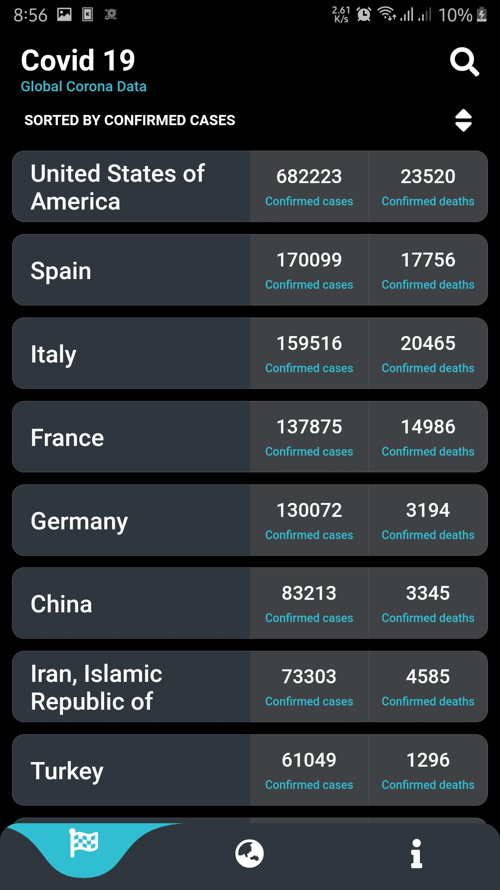
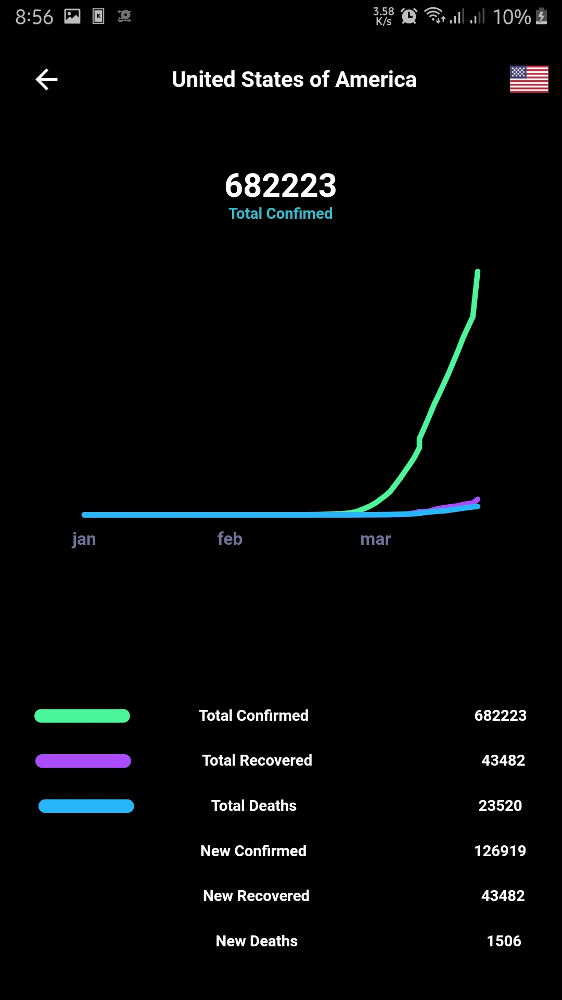
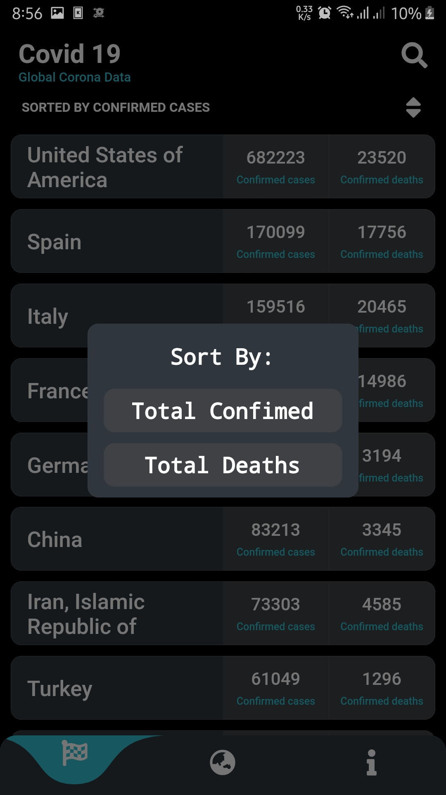
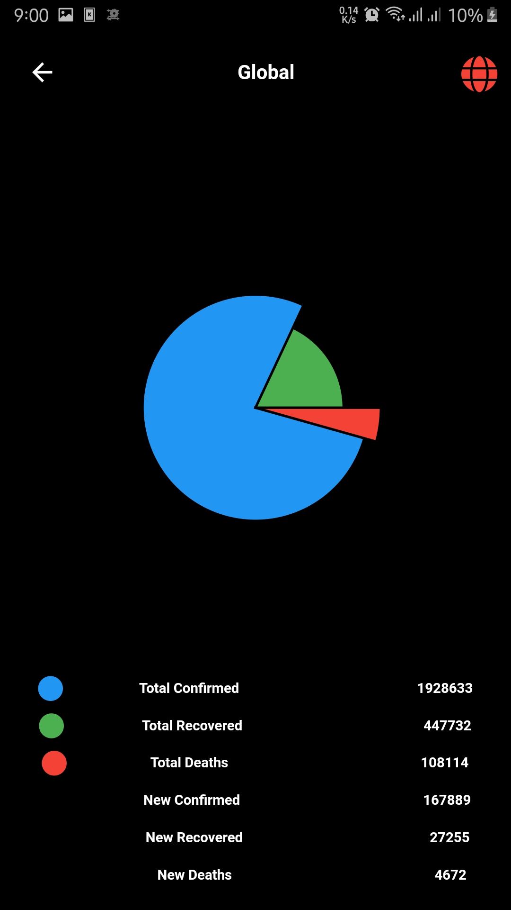

# Covid19

A Covid 19 globle information Live Data using Flutter.

## Download App

[Android](apk/covid19-1.apk)

## Api Used
- [Covid19api](https://api.covid19api.com)
- [publicIp](https://api.ipify.org)
- [GeoLocationFromIp](https://ipapi.co) 

## Screenshots

## Might have some bugs (New in devlopment)

## Getting Started

This project is a starting point for a Flutter application.

A few resources to get you started if this is your first Flutter project:

- [Lab: Write your first Flutter app](https://flutter.dev/docs/get-started/codelab)
- [Cookbook: Useful Flutter samples](https://flutter.dev/docs/cookbook)

For help getting started with Flutter, view our
[online documentation](https://flutter.dev/docs), which offers tutorials,
samples, guidance on mobile development, and a full API reference.
